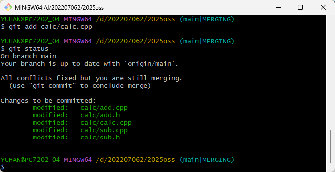
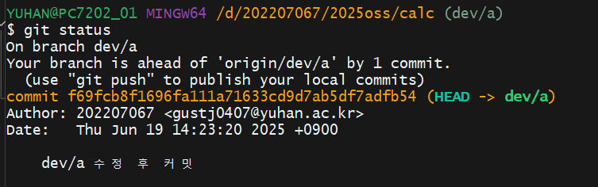
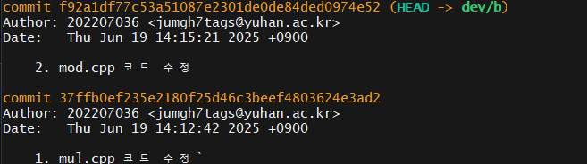
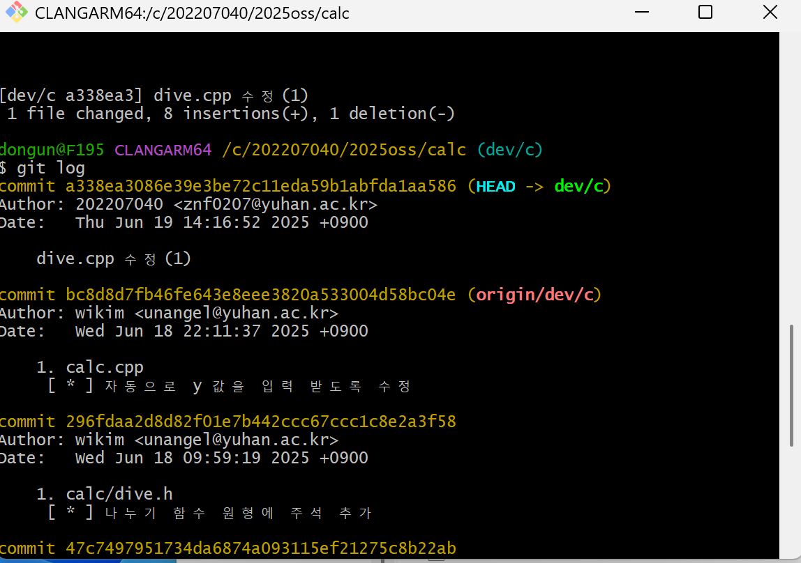
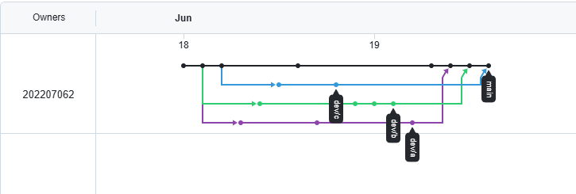
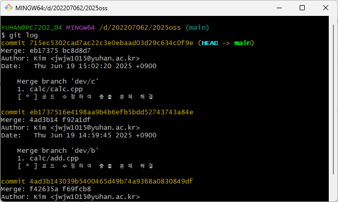
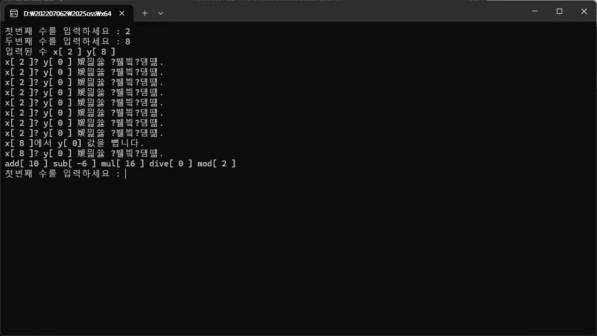

# oss 기말 프로젝트

저장소:https://github.com/202207062/2025oss
|제목|내용|설명|
|------|---|---|
|팀원(역할)|업무|
|김진우(팀장 - 202207062)|main 브랜치 수정|
|오현서(팀원 - 202207067)|dev/a 브랜치 수정|
|박규민(팀원 - 202207036)|dev/b 브랜치 수정|
|이동운(팀원 - 202207040)|dev/c 브랜치 수정|

## 문제해결 방법과 순서서

1. main 브렌치와 dev/a 브렌치 병합
1. main 브렌치와 dev/b 브렌치 병합 중에 충돌 발생
1. 충돌 발생한 dev/b의 내용을 수정하고 fast-forward 병합 완료
1. dev/c 브랜치 병합 중에 충돌 발생
1. main 브랜치의 내용을 수정하고 rebase 병합 완료
1. 결과 화면 캡쳐와 실행 화면 캡처
1. readme.md 수정

## 중간과정 스크린샷
1. 팀원들이 각자 코드를 수정 
 
 
 
 
1. 수정 내용: 코드에 추가를 수행하고 확인
1. git 상태 : dev/a 브랜치 병합 중 문제 발생

1. 발생한 문제 해결 : 코드 수정. 
병합을 취소하고, 코드를 수정하고 다시 커밋 후 병합 진행 
 
1. git 상태 : dev/b 브랜치 병합 중 문제 발생
1. 발생한 문제 해결 : 코드 수정. 
병합을 취소하고, 코드를 수정하고 다시 커밋 후 병합 진행
1. git 상태 : dev/c 브랜치 병합 중 문제 발생
1. 발생한 문제 해결 : 코드 수정. 
병합을 취소하고, 코드를 수정하고 다시 커밋 후 병합 진행
1. 병합 완료 후 상태 화면 
 

git flow : 결과 화면 
 
## 프로그램 실행 결과 화면 
 